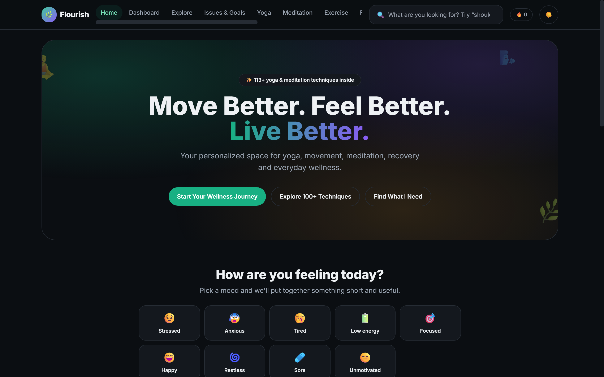
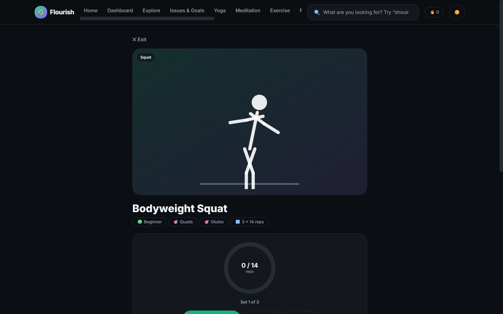
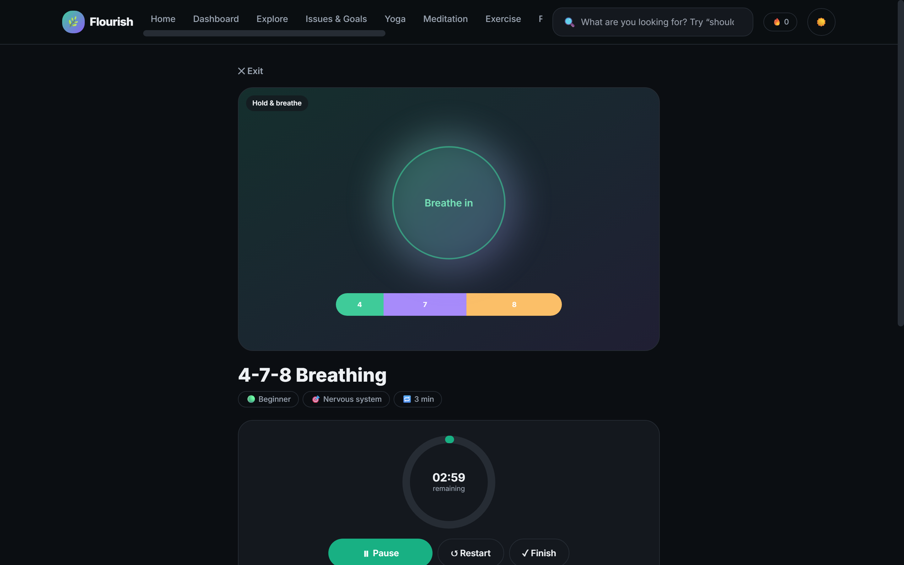
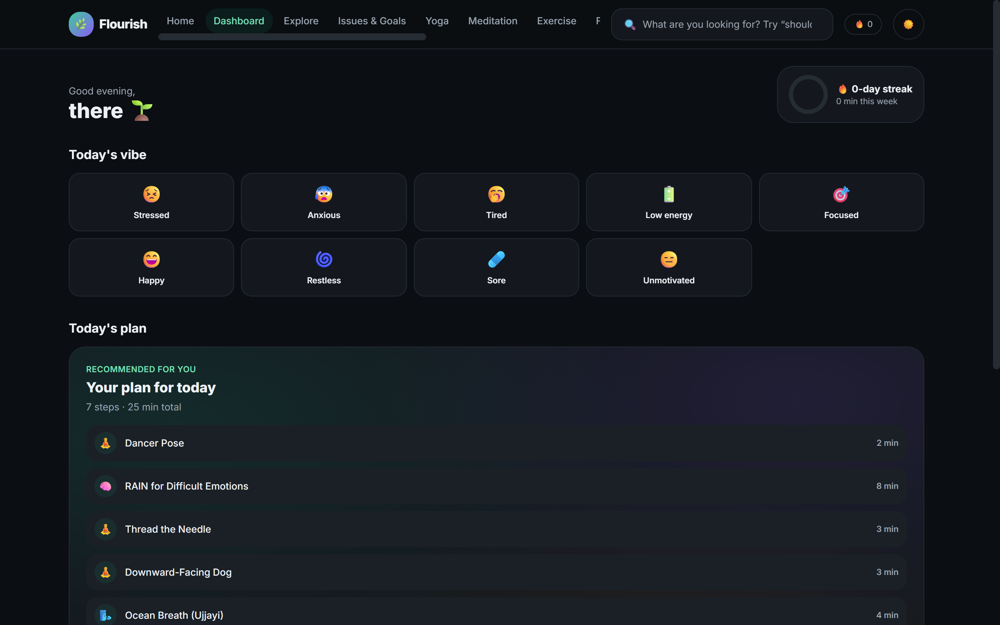
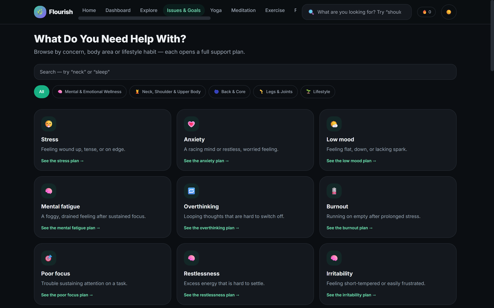
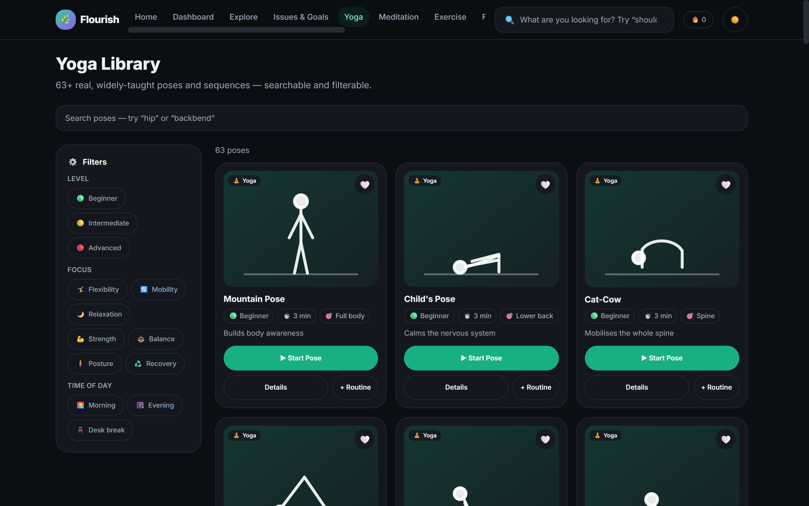
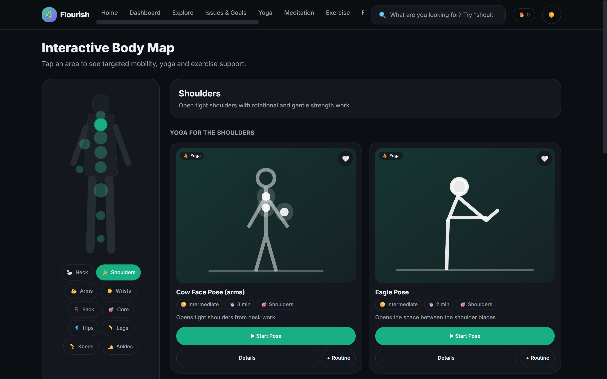
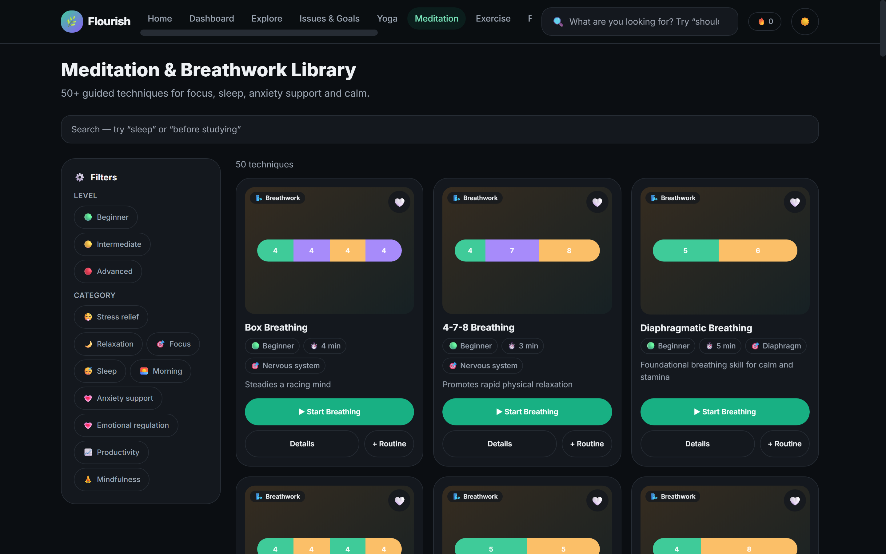
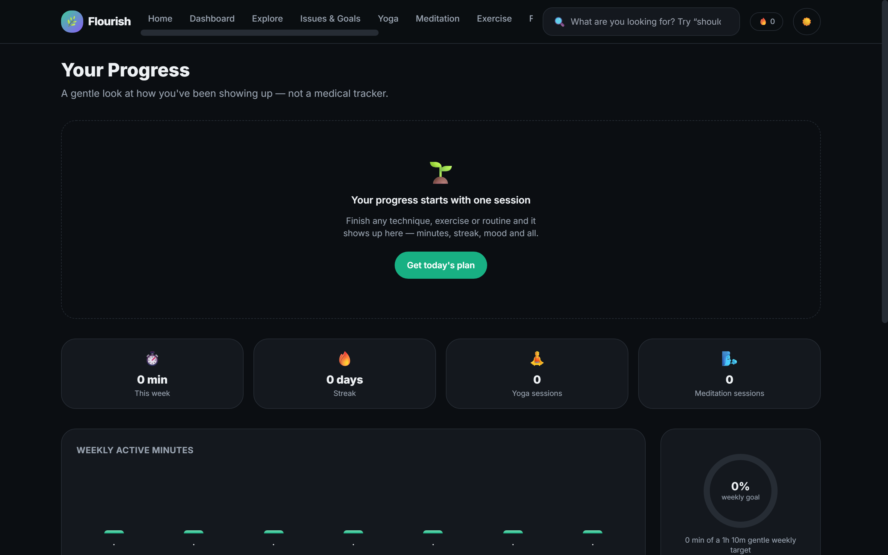
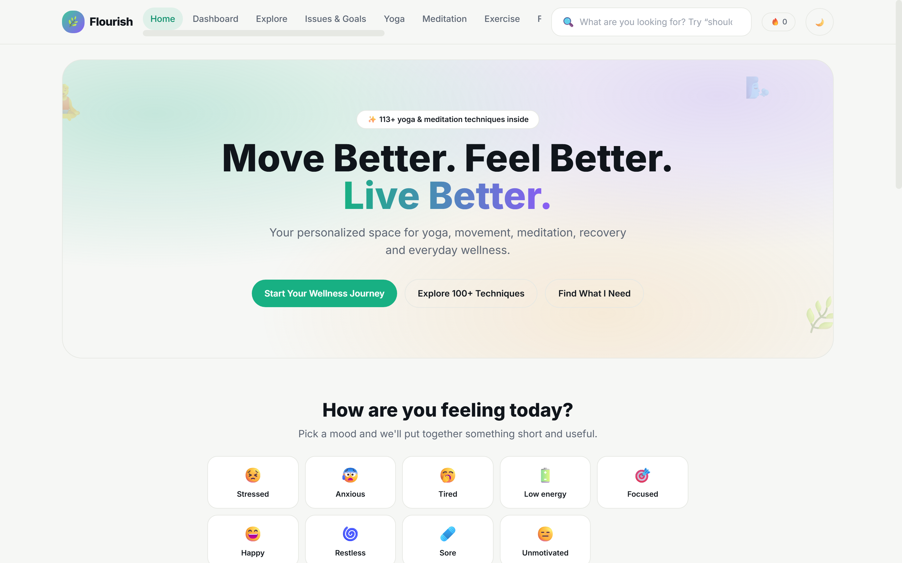

<div align="center">

# 🌿 Flourish

### Move Better. Feel Better. Live Better.

A premium, highly-interactive **yoga, meditation, movement & wellness platform** built for Gen&nbsp;Z and young adults — it feels like a modern wellness app, not a health blog.

**[▶ Live demo — flourish-lake-three.vercel.app](https://flourish-lake-three.vercel.app/)**



</div>

---

## What is Flourish?

You open the app, say **how you feel** or **what you need help with**, and immediately get a short, personalized wellness routine you can start with one tap. Every activity opens in a **Guided Session** with a looping animated demo, a timer or rep counter, one clear cue at a time, and breathing guidance — so you follow the movement, not a wall of text.

- **113+ yoga & meditation/breathwork techniques** — every one a real, widely-taught practice, not generated filler
- **30+ exercises**, **38+ foods**, **34 issue/goal plans**, **12 daily challenges**, **8 preset routines**
- Mood-based **recommendation engine**, drag-to-reorder **routine builder**, interactive **body map**
- **XP, levels, streaks & challenges** for healthy consistency
- **Dark / light mode**, keyboard navigation, reduced-motion support
- 100% frontend — all progress persists in `localStorage`, no backend required

---

## ✨ Guided Exercise Mode

Click any exercise, pose, breathing technique, or routine and it opens a focused player.

| Rep-based exercise | Breathwork |
|---|---|
|  |  |

- **Looping illustrated motion demos** — not stock video. A rigged SVG figure whose limbs animate about their joints for standing movements (squat, lunge, march, twist, reach…), plus hand-drawn animated scenes for Cat–Cow, Plank, Cobra, Bridge, Down Dog, tabletop and lying/seated releases. Honors `prefers-reduced-motion`.
- **Timer** with progress ring for held work; **`12 / 15 reps · Set 2 of 3`** counter with auto-tempo for rep work.
- **Start → Pause / Resume / Restart / Finish.**
- One big **step cue** and a live **Inhale / Exhale** prompt synced to the animation; full instructions sit below, dimmed except the active step.
- **Completion state** — *"Nice work."* → Done · Do Again · Add to Routine — updates XP and streak.
- Routines play as a **guided playlist** (`Step 2 of 4`, Next between steps).

---

## Screens

| How you feel → a plan | Issues & Goals |
|---|---|
|  |  |

| Yoga Library | Interactive Body Map |
|---|---|
|  |  |

| Meditation & Breathwork | Progress |
|---|---|
|  |  |

<details>
<summary>Light mode</summary>



</details>

---

## Feature tour

- **Home** — hero, `How are you feeling today?` mood selector with instant recommendations, `How it works` flow, and quick-starts like *"Try 5-Min Shoulder Relief"*.
- **Recommendation engine** — builds a real routine from mood + available time (+ body area), pulling live entries from the datasets. Regenerate or **Start This Routine** as a guided playlist.
- **Issues & Goals** — 34 concerns across Mental & Emotional Wellness, Neck/Shoulder/Upper Body, Back & Core, Legs & Joints, and Lifestyle. Each opens an explanation, a beginner routine, and recommended yoga / breathwork / exercises / foods with safety notes.
- **Libraries** — Yoga, Meditation & Breathwork, Exercise, Food — searchable, filterable, with skeleton loading and helpful empty states.
- **Body Map** — an interactive SVG body; tap a region for targeted mobility, yoga and exercises.
- **Routine Builder** — drag to reorder, set per-step minutes, save custom routines, launch any routine into Guided Mode.
- **Dashboard ("Today")** — greeting, today's vibe, today's plan, streak, minutes, favorite routines.
- **Progress** — weekly active-minutes chart, mood trend, session breakdown, goal progress, favorites. New-user empty state.
- **Challenges / XP / Levels** — Starter → Consistent → Flow Seeker → Mindful Mover → Wellness Beast.
- **Profile & Settings** — age group, experience, weekly goals, equipment; theme toggle, data export/reset.
- **Safety UX** — persistent disclaimer and an About/Safety page. The app supports wellness and mobility; it never claims to diagnose or treat.

---

## Tech stack

| | |
|---|---|
| **Framework** | React 19 + TypeScript |
| **Build** | Vite 8 |
| **Styling** | Tailwind CSS 3 with CSS custom-property theme tokens |
| **Routing** | React Router 7 |
| **Animation** | Hand-authored CSS keyframes + SVG SMIL — no animation library |
| **State / persistence** | React Context + `localStorage` |
| **Lint** | Oxlint |

No backend, no tracking, no external asset dependencies at runtime.

---

## Getting started

```bash
# clone
git clone https://github.com/Anjali56-creator/Flourish.git
cd Flourish

# install
npm install

# run the dev server → http://localhost:5173
npm run dev

# type-check + production build
npm run build

# preview the production build
npm run preview
```

Requires Node 18+ (developed on Node 22).

---

## Project structure

```
src/
├── components/
│   ├── figures/        # Figure, MotionFigure (animated rig + scenes), poseArt, BreathingPattern
│   ├── guided/         # GuidedPlayer — the reusable guided-session unit
│   ├── layout/         # Navbar, BottomNav, Layout
│   ├── ui/             # ProgressRing, Timer, Chip, Toast, EmptyState, SkeletonCard …
│   └── *Card, MoodSelector, SearchBar, FilterPanel, BodyMap, RecommendationCard
├── data/               # yoga, meditation, exercises, foods, issues, routines, challenges,
│                       # moods, levels, bodyMap, icons, figureMap, motionMap, dose helpers
├── lib/                # store (context + persistence), recommend, search, dose, utils
├── pages/              # Home, Dashboard, Explore, Issues(+Detail), libraries,
│                       # TechniqueDetail, ExerciseDetail, GuidedSession, RoutineBuilder,
│                       # Progress, Challenges, Profile, Settings, About
└── types/              # shared Technique / Exercise / Food / Issue / Routine models
```

### Extending the content

Every library item conforms to a reusable typed object (`src/types/index.ts`). To add a technique, append an entry to the relevant file in `src/data/` and map it to a pose figure in `figureMap.ts` and a motion archetype in `motionMap.ts` (a sensible default is used if you skip these). The architecture is built to scale to thousands of entries.

---

## Accessibility

Keyboard navigable, visible focus rings, semantic landmarks, labelled controls, sufficient contrast in both themes, and full `prefers-reduced-motion` support (animations freeze to a readable static pose).

---

## Disclaimer

Flourish is for **general wellness and movement education only**. It is **not** a diagnosis or a substitute for professional medical advice, and it makes no claim to cure, treat, or diagnose any condition. Stop and consult a professional for severe pain, recent injury or surgery, dizziness, chest pain, difficulty breathing, or any concerning symptom.

---

<div align="center">
<sub>Built with React, TypeScript &amp; Vite · <a href="https://flourish-lake-three.vercel.app/">Live demo</a></sub>
</div>
